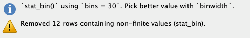

# Setup
## Global options

```{r label = "global-options", highlight=TRUE}

### setting up working environment
### for details see: https://yihui.name/knitr/options/
knitr::opts_chunk$set(
        echo = T,
        message = T,
        error = T,
        warning = T,
        comment = '##',
        highlight = T,
        prompt = T,
        strip.white = T,
        tidy = T
        )

```

## Installing and loading R packages


```{r installing-and-loading-R-packages}

### https://www.tidyverse.org/
if (!require("tidyverse"))
        {install.packages("tidyverse", repos = 'http://cran.wu.ac.at/')
        library(tidyverse)}

### above command installed and loaded the core tidyverse packages:
# ggplot2: data visualisation
# tibble:  a modern take on data frames
# tidyr:   data tidying
# readr:   data import (csv, tsv, fwf)
# purrr:   functional R programming
# dplyr:   data (frame) manipulation
# stringr: string manipulation
# forcats: working with categorial varialbes


### to calculate mode:
if (!require("modeest"))
        {install.packages("modeest", repos = 'http://cran.wu.ac.at/')
        library(modeest)}

# I am going to use the `janitor` package for calculating table totals
if (!require("janitor"))
        {install.packages("janitor", repos = 'http://cran.wu.ac.at/')
        library(janitor)}

```

## Adapt the theme for the graphic display with ggplot2

```{r generate-my-own-theme, include=FALSE}

my_theme <- theme_light() +
        theme(plot.title = element_text(size = 10, face = "bold", hjust = 0.5))
        theme(plot.background = element_rect(color = NA, fill = NA)) +
        theme(plot.margin = margin(1, 0, 0, 0, unit = 'cm'))
```


# End-of-Chapter Exercises

## Calculating decriptive statistics

### Description

The following table contains a set of ACT scores from a sample of college students. The ACT is a standardized college-readiness exam taken by many U.S. students; scores can range fro 1 to 36.


Student | ACT  | $(X~i~ - M)$ | $(X~i~ - M)^2$
--------| ---- | ---------- | -------------
 1 | 26 |
 2 | 24 |
 3 | 28 |
 4 | 31 |
 5 | 20 |
 6 | 27 |
 7 | 18 |
 8 | 17 |
 9 | 21 |
10 | 29 |
11 | 24 |
Total | 

a. **Location:** Calculate the mean (_M_), median, and mode for this sample.
b. **Spread:** Calculate the standard deviation (_s_), range and interquartile range for this sample. For _s_, fill in the two columns on the right in the table above, then use the formula to calculate _s_ yourself.


### Solution

```{r laod-data-into-vector}
ACT <- c(26, 24, 28, 31, 20, 27, 18, 17, 21, 29, 24)
```

With `summary` there is a covenient command in R to print out some of the most important descriptive statistics.

```{r summary-of-descriptive-statistics}
summary(ACT)
```

The summary command does not display mode, variance, standard deviation and IQR. With the exception of mode all these command are included in the base R installation. To calculate the mode we need _modeest_, a package for mode estimation.

In R there are for the same task often several solution possible. I will add some of them.

**ADD QUANTILE!!!**

Parameter   | Command in R           | Value  | 
------------|------------------------|-------:|
Mean _M_    | `round(mean(ACT),2)`   | `r round(mean(ACT),2)` 
Median (V1) | `median(ACT)`          | `r median(ACT)`
Median (V2) | `fivenum(ACT)[3]`      | `r fivenum(ACT)[3]`
Mode        | `mfv(ACT)`             | `r mfv(ACT)`
Variance    | `round(var(ACT),2)`    | `r round(var(ACT),2)`
 _s_        | `round(sd(ACT),2)`     | `r round(sd(ACT),2)`
Range (V1)  | `range(ACT)`           | `r range(ACT)`
Range (V2)  | `fivenum(ACT)[c(1,5)]` | `r fivenum(ACT)[c(1,5)]`
IQR         | `IQR(ACT)`             | `r IQR(ACT)`
Q1,Q3       | `fivenum(ACT)[c(2,4)]` | `r fivenum(ACT)[c(2,4)]`


To populate the table programmatically I will convert ACT to a data frame `ACT_df = as.data.frame(ACT)` resp. in a `tibble` as [tibbles has some advantages over data frames](https://cran.r-project.org/web/packages/tibble/vignettes/tibble.html). (The `tibble` package is part of the `tidyverse`.) 

```{r convert-vector-to-tibble}
### Calling `as_tibble()` on a vector is discouraged, because the behavior is likely to change in the future.
### I am using instead the `enframe` command
ACT_df <- enframe(ACT, name = "Student", value = "ACT")
```

Havin

```{r generate-columns-with-package-dplyr}

## using the pipe operator (https://magrittr.tidyverse.org/)
ACT_df <- ACT_df %>% mutate( # dplyr package; included in tidyverse
    `Xi-M` = round(ACT_df$ACT - mean(ACT_df$ACT),2),
    # `(Xi-M)^2` = round(((ACT_df$ACT - mean(ACT_df$ACT))^2),2)
    `(Xi-M)^2` = round(`Xi-M`^2,2)
    )


ACT_df <- ACT_df %>%
    adorn_totals("row") # janitor package
ACT_df[12, 3] <- "   " # summing up Xi-M does not make sense

knitr::kable(ACT_df, 
             booktabs = TRUE, 
             caption = "ACT Scores for Exercise 1 of Chapter 3",
             align = 'rrrr')
```

This table has not the same information as in the book p.505. At first I tried to build it similar but this complicates everything as it is not suitable for using R.

## Looking at some distributions

> From the book website, load the `College_Survey_1` data set. This is a large data set containing data from a wide-ranging survey of college students. You can read the code book for the data file to get a better sense of the different variables measured.

### Distribution of positive affect scores

#### Load data set


In RStudio there are several options to import data files via  the menu available. I generally prefer .csv files using the option `From Text (readr)`. `readr` is a package included in `tidyverse`.


In the import data window you can preview the first 50 data. The R program code is displayed in the bottom right section of the window, so that you can automate this step. This is not only time saving but also necessary for better reproducibility. As we already have loaded `readr` and do not want to display the dataset in RStudio automatically we only need the second line of the program code.

```{r load-college-survey-1}
college1 <- read_csv("_Material/AllEOC_Exercises/College_Survey_1/College_Survey_1.csv")
```

After loading the dataset you will see in the console window the parameters `readr` has used to parse the column specification.  This all is done normally correctly, automatically, and hassle-free.

But it is import to check these parsing decisions made by `readr`. Ignore the strange `[31m` and `[39m` strings in the printed output. These are the internal characters for changing text to red color. This is the way `readr` warns you that there are character columns in the table. You can convert them to factor variable but this is with extra columns for Gender (Gender_Code), Schoolyear (Schoolyear_Code), and Student_Athlete (Student_Athlete_Code) already done.

Remains Exercise and Rave_Score. Both columns contain numbers and should display like the default mode in the format col_double() which is the R code for double precision floating point numbers. We have to inspect these two columns more in detail: Use the command `View(college1)` from the console or display the data set by choosing it form the tab `Environment` on the right upper window. 

The reason for the wrong format is that the variable `Exercise` contains '-' and `Raven_Score` has '%'-signs added after the numbers. I will deal with this problem later, when we are going to use one of this variables.

During the inspection of the data set I noticed two other minor problems: 

* The last few rows --- from row 244 -- 247 are emtpy, respectively filled witn NAs ("not available"). We may delete these rows. 
* There is a typo in the column name `Shool_Year` which should be `School_Year`.

```{r two-minor-problems}
college1 <- college1[1:243, ] # delete empty rows
colnames(college1)[5] <- "School_Year"
```


#### Visualize the distribution

> Visualize the distribution of positive affect scores (Positive_Affect). Students rate how often they experience each of 10 positive emotions, using a scale from 1 (_not at all_) to 5 (_extremely_), then the score is the average of the 10 ratings.

The reference in the codebook to the PANAS scale is not valid anymore. But I found an explanation and a template with the questionaire on the [toolsHero website](https://www.toolshero.com/psychology/personal-happiness/panas-scale/).

Following the recommendation by the paper [Getting Started with the New Statistics in R](https://s3-eu-west-1.amazonaws.com/s3-euw1-ap-pe-ws4-cws-documents.ri-prod/9781138825529/SoftwareGuide/R_Guide.zip) (p.7) I am going to use the `ggplot2` package. See details to the command at the [ggplot2 web page](https://ggplot2.tidyverse.org/reference/geom_histogram.html).

#### Histogram

```{r dist-pos-affect-v1}
ggplot(college1, aes(Positive_Affect)) +
  geom_histogram()
```

After executing this command `ggplot2` gives us a notification and a warning message:



We can experiment with different `binwidth` to get a feeling about the effects of the visualization of the  distribution. After a (mental) note that 12 records removed as no data are available `(NA)`, we tell R to remove this missing values silently.

```{r dist-pos-affect-v2}
ggplot(college1, aes(Positive_Affect)) +
  geom_histogram(binwidth = .1, na.rm = TRUE) # experiment with the binwidth
```

#### Dot plot

For more information about this command see: https://ggplot2.tidyverse.org/reference/geom_dotplot.html

```{r display-positive-affect-as-dot-plot}
ggplot(college1, aes(Positive_Affect)) + 
    geom_dotplot(binwidth = .1, na.rm = TRUE, method = "histodot", stackratio = 1.1) +
    coord_fixed(ratio = 2)
```

It is a [notorious problem](https://github.com/tidyverse/ggplot2/issues/2203) with dot plots produced by `ggplot2` that the y-axis is normalized and displays meaningless values between 0 and 1. I found a workaround recently [posted at StackOverflow](https://stackoverflow.com/questions/49330742/change-y-axis-of-dot-plot-to-reflect-actual-count-using-geom-dotplot).

```{r}
library(ggplot2)
library(ggExtra)
library(dplyr)

yheight = 20 # taken from the histogramm
# basic dotplot (binwidth = the accuracy of the data)
dotchart = ggplot(college1, aes(x = Positive_Affect), dpi = 600)
dotchart = dotchart + geom_dotplot(binwidth = 0.1, 
                                   method = "histodot", 
                                   dotsize = 1, 
                                   fill = "blue",
                                   na.rm = TRUE)

# use coor_fixed(ratio=binwidth*dotsize*max frequency) to setup the right y axis height.
dotchart = dotchart + 
    coord_fixed(ratio = 0.1 * yheight)

# add tick mark on y axis to reflect frequencies. Note yheight is max frequency.
dotchart = dotchart + 
    scale_y_continuous(limits=c(0, 1), expand = c(0, 0), breaks = seq(0, 1, 1/yheight), labels=seq(0, yheight))

# remove x y lables and remove vertical grid lines
dotchart = dotchart + 
    labs(x=NULL, y=NULL) +
    theme_bw() +
    removeGridX()
dotchart
```

#### Interpretation

> Describe the distribution you see, noting the location, spread, and shape, and the number of major peaks.

```{r positive-affects-description}
summary(college1$Positive_Affect)
sd1 <- round(sd(college1$Positive_Affect, na.rm = TRUE),2)
```
_s_ = `r sd1`

> Positive affect is relatively normally distributed—there is a single, strong peak and the distribution is fairly symmetrical. The mean score of 3.43 is a little above the midpoint of the 1–5 scale, indicating that students on average feel moderate levels of positive affect. There is wide spread, with _s_ = 0.71 and scores ranging across almost the full range.


### Distribution of student age

The next exercises are similar. I am going to produce just the histograms.

> Visualize and describe the distribution of student age. Note the skew and the high outliers. Note the mean and median and explain why they differ. Would it make sense to delete outliers? Explain.


```{r student-age-description}
ggplot(college1, aes(Age)) +
  geom_histogram(binwidth = 1, na.rm = TRUE)
summary(college1$Age)
sd2 <- round(sd(college1$Age, na.rm = TRUE),2)
```

_s_ = `r sd2`

> There is strong positive skew, with most students aged 18–22, but a long upper tail of ages ranging up to nearly 60. The mean (21.8 years) is most affected by the outliers, and the median (20 years) is probably a more useful indicator of location. The skew causes the mean to be larger than the median. The college has mostly younger students, but also some older returning and non-traditional students. Removing outliers would misrepresent the sample, by omitting those older students. They should be removed only if there is reason to examine the subgroup of younger students, perhaps aged up to about 32.

### Distribution of exercise scores

Again the URL in the code book does not exist anymore but you can [download the article](https://hfjc.library.ubc.ca/index.php/HFJC/article/view/82/49) dircetly from Gaston Godin's web page.

> Visualize the distribution of exercise scores, which are calculated as 9×strenuous + 5×moderate + 3×light, where students report the number of times per week they engage in strenuous, moderate, and light exercise. There is an extreme outlier. What would that extreme value mean? Would it make sense to delete it? Explain. If you do delete it, what happens to the standard deviation? Test your prediction.

Here we cannot use the previous `ggplot2` command to display the histogram. Try it out and you will get the following error message:

> Error: StatBin requires a continuous x variable: the x variable is discrete. Perhaps you want stat="count"?

The reason is the above mentioned wrong format of the `Exercise` variable. The dash '-' is a character, so the whole column consists of characters. The meaning of the dash sign is that there was no exercise reported. To distinguish it from NA (= not available) which means the student did not answer this question, no exercise was coded unfortunately with a '-' instead a 0. For questions of reproducibility it is always a good idea not to change the original data set. Therefore I will create a new variable `Exercise_Code`, convert all dashes to 0 and format the column `as.double()`. 

```{r convert-column-to-numeric}
college1$Exercise_Code <- college1$Exercise                 # copy column
college1 <- college1[, c(1:18, 24, 19:23)]                  # reorder Exercise_Code after Exercise
college1$Exercise_Code[college1$Exercise_Code == '-'] <- 0  # set all '-' to 0
college1$Exercise_Code <- as.double(college1$Exercise_Code) # convert column from character to double 
```

The last line spits out the message "NAs introduced by coercion". This is a kind of error message saying that some number conversion did not succeed. Instead converting number strings to numbers NAs were created. The find this error was a little bit tricky but finally it turned out the outlier in row 138 with `1,810.00` was the problem: The comma in this big figure is interpreted as a character. 

We could change this unique value but I will provide a [general solution taken from StackOverflow](https://stackoverflow.com/questions/1523126/how-to-read-data-when-some-numbers-contain-commas-as-thousand-separator). We have to delete the "destroyed" column "Exercise_Code" and start again with the conversion process. In the real praxis we would change simply the code junk above an run the whole program again.


```{r convert-column-to-numeric-2}
college1 <- college1[, c(1:18, 20:24)]                      # delete column `Exercise_Code`
college1$Exercise_Code <- college1$Exercise                 # create it again
college1 <- college1[, c(1:18, 24, 19:23)]                  # reorder Exercise_Code after Exercise
college1$Exercise_Code[college1$Exercise_Code == '-'] <- 0  # set all '-' to 0

## and now the new line: deleting commas and converting to double precision floating point numbers
college1$Exercise_Code <- as.double(gsub(",", "", college1$Exercise_Code))
```

```{r exercise-score-description}
ggplot(college1, aes(Exercise_Code)) +
  geom_histogram( binwidth = 15, na.rm = TRUE )
summary(college1$Exercise_Code)
sd3 <- round(sd(college1$Exercise_Code, na.rm = TRUE),2)
```
_s_ = `r sd3`

> There is considerable positive skew. Most students report relatively little exercise, but the right tail pulls the mean (54.7) way above the median (22). The extreme outlier of 1,810 corresponds to engaging in strenuous exercise 201 times per week, which is hardly credible. Most likely, the student didn’t understand the question, made an error, or gave a non-serious answer, so there is good reason to delete this outlier, which would decrease the SD. If it is deleted, _s_ decreases from 135 to 64.7. As always, if you delete an outlier report how, when, and why the descision was made to remove it.


```{r exercise-score-description-without-outlier}
college1$Exercise_Code[138] <- NA
ggplot(college1, aes(Exercise_Code)) +
  geom_histogram( binwidth = 10, na.rm = TRUE )
summary(college1$Exercise_Code)
sd4 <- round(sd(college1$Exercise_Code, na.rm = TRUE),2)
```
_s_ = `r sd4`


### Distribution of Raven scores

> Visualize the distribution of Raven scores (Raven_Score), which are the proportion correct on a short 8-item IQ test. Next, visualize the distribution of GPA. Compare the two distributions. Why might they differ in shape?

At first we have to recode the variable to get rid of the %-sign and to convert the variable to a double precise floating number. This is similar procedure as we have already done with the `Exercise` variable.

```{r convert_raven_score}
college1$Raven_Score_Code <- college1$Raven_Score          # copy column
college1$Raven_Score_Code <- as.double(gsub("%", "", college1$Raven_Score_Code))
```

Now we can continue with dislaying the histogram. By now this should already a routine operation.

```{r raven-score-distribution}
ggplot(college1, aes(Raven_Score_Code)) +
  geom_histogram( binwidth = 1, na.rm = TRUE )
summary(college1$Raven_Score_Code)
sd5 <- round(sd(college1$Raven_Score_Code, na.rm = TRUE),2)
```


_s_ = `r sd5`

```{r display-raven-score-as-dot-plot}
ggplot(college1, aes(Raven_Score_Code)) + 
    geom_dotplot(binwidth = 1, na.rm = TRUE, method = "histodot")
```


```{r gpa-distribution}
ggplot(college1, aes(GPA)) +
  geom_histogram( binwidth = .1, na.rm = TRUE )
summary(college1$GPA)
sd6 <- round(sd(college1$GPA, na.rm = TRUE),2)
```

_s_ = `r sd6`


```{r display-GPA-as-dot-plot}
ggplot(college1, aes(GPA)) + 
    geom_dotplot(binwidth = .05, na.rm = TRUE, method = "histodot")
```

> Raven IQ Scores are relatively normally distributed. The mean is .377, median is .375, and standard deviation is .199. In contrast, GPA is very strongly negatively skewed, with scores stacked up near 4.0, the top of the GPA scale. A long tail extends down to very low values of GPA. The mean is 3.34, median is 3.40, and SD is 0.51. Different variables can have different distributions, even for the same sample. However, we expect IQ and GPA to be related, so it’s perhaps surprising that their two distributions are so different. The GPA distribution, with most of the scores concentrated in the 3.5–4.0 range, suggests that the testing is not sufficiently challenging to distinguish among students in the upper parts of the distribution. You may have heard of grade inflation occurring in the last one or two decades. Search online for “college grade inflation”, or similar, and you should easily find statistics describing a dramatic increase in the proportion of A grades in recent years, and interesting discussion about likely causes and consequences.

### Presentation of nominal data

ATTENTION: DATAFRAMES ARE ALREADY INCLUDED IN THE itns PACKAGE!!!  USE IT AND CHECK OUT IF THEY ALSO HAVE MY EXPERIENCED PROBLEMS OF COLUMNS "EXERCISE" AND "RAVEN_SCORE" (AND THE TYPO IN SCHOOL-YEAR)

CONVERT THIS TO FACTORS! AND EXPLAIN FACTORS! see: https://www.cyclismo.org/tutorial/R/types.html
WHAT IF I USE "Male" and "Female" AS FACTORS?

I ALSO HAVE TO THINK WHEN AND WHERE I WILL DO ANNOTAION (TO FORMAT, TO LABEL THE AXIS AND TO WRITE A TITLE FOR THE PLOT
EVENTUALLY ALSO PROVIDING FIGURE NUMBERS AUTOMATICALLY

HERE IT DEPENDS ALSO IF I AM GOING TO USE BOOKDOWN???

> In this data set, Gender is coded as female = 1 and male = 2. ESCI calculates that the mean is M = 1.28 for Gender. Does this make sense? How might you better summarize gender in this sample?

```{r}
# ggplot(college1, aes(Gender)) + 
#     geom_bar()
(gender <- table(college1$Gender))
summary(factor(college1$Gender_Code))
attributes(gender)
summary(gender)
levels(gender)
```


> No! It doesn’t make sense to calculate a mean for data on a nominal scale. It’s often convenient to represent nominal data with numerical codes, but it’s important to remember that these codes have no numerical meaning, and thus calculation of most descriptive statistics doesn’t make sense. Nominal data can be summarized with frequencies (175 females and 68 males) and relative frequencies (72.0% females and 28.0% males).

```{r experiment-with-named-vector}
sd7 <- round(sd(college1$GPA, na.rm = TRUE),2)
summary(college1$GPA)
s <- signif(c(summary(college1$GPA), SD = sd(college1$GPA, na.rm = TRUE)),2)
s
sd7
```

