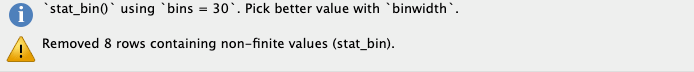
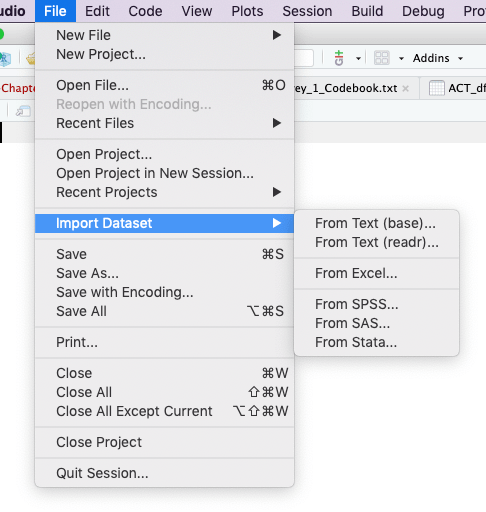
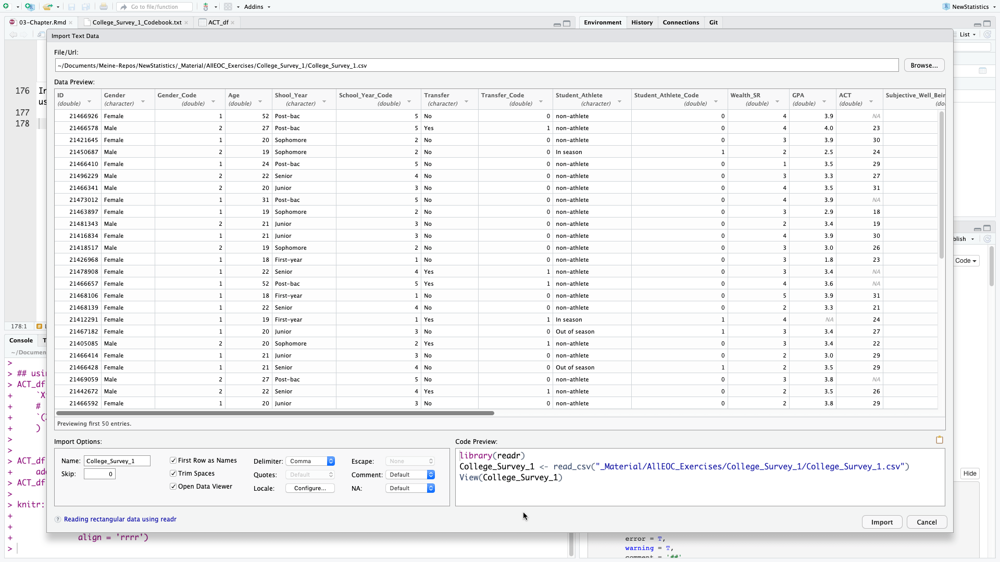

# Setup
## Global options

```{r label = "global-options", highlight=TRUE}

### setting up working environment
### for details see: https://yihui.name/knitr/options/
knitr::opts_chunk$set(
        echo = T,
        message = T,
        error = T,
        warning = T,
        comment = '##',
        highlight = T,
        prompt = T,
        strip.white = T,
        tidy = T
        )

```

## Installing and loading R packages


```{r installing-and-loading-R-packages}

### accompanying R package: https://github.com/gitrman/itns
if (!require("itns"))
        {remotes::install_github("gitrman/itns", 
                         build = TRUE, build_opts = c("--no-resave-data", "--no-manual"))
        library("itns")}


### https://www.tidyverse.org/
if (!require("tidyverse"))
        {install.packages("tidyverse", repos = 'http://cran.wu.ac.at/')
        library(tidyverse)}

### above command installed and loaded the core tidyverse packages:
# ggplot2: data visualisation
# tibble:  a modern take on data frames
# tidyr:   data tidying
# readr:   data import (csv, tsv, fwf)
# purrr:   functional R programming
# dplyr:   data (frame) manipulation
# stringr: string manipulation
# forcats: working with categorial varialbes


### to calculate mode:
if (!require("modeest"))
        {install.packages("modeest", repos = 'http://cran.wu.ac.at/')
        library(modeest)}

# I am going to use the `janitor` package for calculating table totals
if (!require("janitor"))
        {install.packages("janitor", repos = 'http://cran.wu.ac.at/')
        library(janitor)}

```

## Theme adaption for the graphic display with `ggplot2`

```{r generate-my-own-theme}

my_theme <- theme_light() +
        theme(plot.title = element_text(size = 10, face = "bold", hjust = 0.5))
        theme(plot.background = element_rect(color = NA, fill = NA)) +
        theme(plot.margin = margin(1, 0, 0, 0, unit = 'cm'))
```


# End-of-Chapter Exercises

## Calculating decriptive statistics

### Description

The following table contains a set of ACT scores from a sample of college students. The ACT is a standardized college-readiness exam taken by many U.S. students; scores can range fro 1 to 36.


Student | ACT  | $(X~i~ - M)$ | $(X~i~ - M)^2$
--------| ---- | ---------- | -------------
 1 | 26 |
 2 | 24 |
 3 | 28 |
 4 | 31 |
 5 | 20 |
 6 | 27 |
 7 | 18 |
 8 | 17 |
 9 | 21 |
10 | 29 |
11 | 24 |
Total | 

a. **Location:** Calculate the mean (_M_), median, and mode for this sample.
b. **Spread:** Calculate the standard deviation (_s_), range and interquartile range for this sample. For _s_, fill in the two columns on the right in the table above, then use the formula to calculate _s_ yourself.


### Solution

```{r laod-data-into-vector}
ACT <- c(26, 24, 28, 31, 20, 27, 18, 17, 21, 29, 24)
```

With `summary` there is a covenient command in R to print out some of the most important descriptive statistics.

```{r summary-of-descriptive-statistics}
summary(ACT)
```

The summary command does not display mode, variance, standard deviation and IQR. With the exception of mode all these command are included in the base R installation. To calculate the mode we need _modeest_, a package for mode estimation.

In R there are for the same task often several solution possible. I will add some of them.


Parameter     | Command in R           | Value                  | 
--------------|------------------------|-----------------------:|
Mean _M_      | `round(mean(ACT),2)`   | `r round(mean(ACT),2)` 
Median (V1)   | `median(ACT)`          | `r median(ACT)`
Median (V2)   | `fivenum(ACT)[3]`      | `r fivenum(ACT)[3]`
quantile (V3) | `quantile(ACT)[[3]]`   | `r quantile(ACT)[[3]]`
Mode          | `mfv(ACT)`             | `r mfv(ACT)`
Variance      | `round(var(ACT),2)`    | `r round(var(ACT),2)`
 _s_          | `round(sd(ACT),2)`     | `r round(sd(ACT),2)`
Range (V1)    | `range(ACT)`           | `r range(ACT)`
Range (V2)    | `fivenum(ACT)[c(1,5)]` | `r fivenum(ACT)[c(1,5)]`
IQR           | `IQR(ACT)`             | `r IQR(ACT)`
Q1,Q3         | `fivenum(ACT)[c(2,4)]` | `r fivenum(ACT)[c(2,4)]`


To populate the table programmatically I will convert ACT to a data frame `ACT_df = as.data.frame(ACT)` resp. in a `tibble` as [tibbles has some advantages over data frames](https://cran.r-project.org/web/packages/tibble/vignettes/tibble.html). (The `tibble` package is part of the `tidyverse`.) 

```{r convert-vector-to-tibble}
### Calling `as_tibble()` on a vector is discouraged, 
### because the behavior is likely to change in the future.
### I am using instead the `enframe` command
ACT_df <- enframe(ACT, name = "Student", value = "ACT")
```


```{r generate-columns-with-package-dplyr}

## using the pipe operator (https://magrittr.tidyverse.org/)
## using mutate from the dplyr package which is also included in tidyverse
ACT_df <- ACT_df %>% mutate( 
    `Xi-M` = round(ACT_df$ACT - mean(ACT_df$ACT),2),
    `(Xi-M)^2` = round(`Xi-M`^2,2)
    )


ACT_df <- ACT_df %>%
    adorn_totals("row") # janitor package to add totals
ACT_df[12, 3] <- "   " # summing up Xi-M does not make sense


knitr::kable(ACT_df, 
             booktabs = TRUE, 
             caption = "ACT Scores for Exercise 1 of Chapter 3",
             align = 'rrrr')
```

This table has not the same information as in the book p.505. At first I tried to build it similar but this complicates everything as it is not suitable for using R.

## Loading our first data set

### Inspecting the `itns`-package

In the task description of the _itns_-book you will find the following passage (p.68):

> From the book website, load the `College_Survey_1` data set. This is a large data set containing data from a wide-ranging survey of college students. You can read the code book for the data file to get a better sense of the different variables measured.

But you do not need to load the file into R as there are all these data sets already included in the `itns` package, which we already have loaded into R. In this package the data sets are already cleaned and made compatibel with the R language. This is a great advantage and helps us to concentrate just on the exercises. As in real life you will not have your data already cleaned, I will in the last section of this chapter explain some of the necessary procedures you whould normally apply to every new data set you want to work with.

In the documentation the name of the `College_Survey_1` data set in the `itns` pacakge is `college_survey1`. When you have already the package attached you can find this out with the command `ls("package:itns")` our better in RStudio with the console command `help(package = itns)`. (Our you can also go to the "Packages" tab and search for "itns") The former displays the objects of the package in your RMarkdown file, the latter opens up the documentation page in the RStudio help tab.

```{r list-itns-objects}
ls("package:itns") # list all objects of the itns package
```

Further on I will only describe the RStudio version. RStudio is the most productive R IDE (Integrated Development Environment) I know about. It is free and works with many platforms. You can download the lastest version at https://www.rstudio.com/products/rstudio/download/#download

To detect the name of the variables (= columns) and the data structure we use the RStudio `View` command:

```{r view-college-survey1}
View(college_survey1) # opens the data set in the RStudio data browser
```

### Reading the codebook for `college-survey1`

Even the data set is already included in the `itns` package, you still will need to go to the companion website and download the data set as you will need the code book to understand what all the variables and codes mean. To save you time I have it included here. 

But keep in mind that the variable names in the `college-survey1` are slighty different than in `College_Survey_1`. The main difference is that the R variables are not capitalized. As R is case sensitive, we need always to look up the correct names for the R variables (columns). 

**Survey of College Attitudes**

This is data from survey of college students.  The survey was put together as a classroom project, and measures a number of different constructs.  Note that not all participants elected to answer all items--blanks represent  scales that were not completed by that participant.


* ID  - 
* Gender :  Self-reported gender, Male or Female
* Gender_Code:  1 for Female, 2 for Male
* Age: Self-reported age in years
* School_Year - Self reported, First-year, sophomore, junior, senior, or post-bac
* School_Year_Code: 1 = first-year, 2 = sophomore,3 = junior, 4 = senior, 5 = post-bac
* Transfer: No if student did not transfer to current school, Yes if student transferred to current school
* Transfer_Code: 0 = not a transfer student, 1 = transfer student
* Student_Athlete: self-reported, non-athlete, or athlete in or out of season
* Student_Athlete_Code: 0 = not a student athlete, 1 = student athlete
* Wealth_SR:  Single item: "Considering all the others students you've met here at SCHOOL NAME how would you rank yourself in terms of wealth?" rated on scale from 1 (well below average) to 5 (well above average)
* GPA: Self-reported GPA, 0-4point scale
* ACT: Self-reported ACT score
* Subjective_Well_Being: Average of 5-item satisfaction with life scale by Deiner, rated on scale from 1 (strongly disagree) to 7 (strongly agree).  Sample item: "I am satisfied with my life".  See http://internal.psychology.illinois.edu/~ediener/SWLS.html
* Positive_Affect: Average of 10-item scale of frequency of experiencing positive emotions over the past week, rated on a scale from 1 (verly slightly to not at all) to 5 (extremely).  Sample items: Enthusiastic, Proud, Inspired...Part of the PANAS scale.
* Negative_Affect : Average of 10-item scale of frequency of experiencing negative emotions over the past week.  Rated on scale from 1( very slightly to not at all) to 5 (extrmely).  Sample items: Nervous, irritable, hostile, etc>0.  Part of the PANAS scale. See http://booksite.elsevier.com/9780123745170/Chapter%203/Chapter_3_Worksheet_3.1.pdf 
* Relationship_Confidence-   Average of a 7-item scale of confidence in having romantic relationships, rated on a scale from 1 (not at all characteristic of me) to 5 (very characteristic of me).  Sample item: "I am a good partner for a romantic relationship)
* Exercise  - Exercise score on the Godin Leisure-Time Exercise Quetionnaire.  This asks participants to rate how often during a regular week they engage in strenuous, moderate, or light exercise.   A total score is calculated as 9*strenuous + 5*moderate + 3*light.  See http://dapa-toolkit.mrc.ac.uk/documents/en/God/Godin_Leisure-Time_Exercise_Q.pdf
* Academic_Motivation_Intrinsic   - Average score on 6-item measure of intrinsic acadmic motivation.  Participants respond to the prompt "Why do you go to college" and respond to each item with a rating from 1 (does not correpond at all) to 7 (corresponds exactly).  Sample item: "For the intense feelings I experience when I am communicating my own ideas to others".  See http://www.er.uqam.ca/nobel/r26710/LRCS/scales/emec_en.doc
* Academic_Motivation_Extrinsic  - Average score on 7-item measure of extinsic acadmic motivation.  Participants respond to the prompt "Why do you go to college" and respond to each item with a rating from 1 (does not correpond at all) to 7 (corresponds exactly).  Sample item: "Because with only a high-school degree I would not find a high-paying job later one".  See http://www.er.uqam.ca/nobel/r26710/LRCS/scales/emec_en.doc
* Academic_Motivation_Amotivation   - Average score on 2-item measure of extinsic acadmic motivation.  Participants respond to the prompt "Why do you go to college" and respond to each item with a rating from 1 (does not correpond at all) to 7 (corresponds exactly).  Sample item: "Honestly, I don't know; I really feel that I am wasting my time in school.".  See http://www.er.uqam.ca/nobel/r26710/LRCS/scales/emec_en.doc
* Inteligence_Value  - Measure of degree to which participant values intelligence, rated on a scale from 1 (strongly agree) to 5 (strongly agree).  Sample item: "Intelligence greatly contributes to success in life.".  See 
* Raven_Score - % correct out of 8 items on the Raven Progressive Matrix Scale, a scale of logical thinking/IQ.   Adapted from https://www.raventest.net/.  

## Distribution of positive affect scores

Now we can start to visualize the different distribution as described in 2a-e (pp.68f.)

### Visualize the distribution

> Visualize the distribution of positive affect scores (Positive_Affect). Students rate how often they experience each of 10 positive emotions, using a scale from 1 (_not at all_) to 5 (_extremely_), then the score is the average of the 10 ratings.

The reference in the codebook to the PANAS scale is not valid anymore. But I found an explanation and a template with the questionaire on the [toolsHero website](https://www.toolshero.com/psychology/personal-happiness/panas-scale/).

Following the recommendation by the paper [Getting Started with the New Statistics in R](https://s3-eu-west-1.amazonaws.com/s3-euw1-ap-pe-ws4-cws-documents.ri-prod/9781138825529/SoftwareGuide/R_Guide.zip) (p.7) I am going to use the `ggplot2` package. See details to the command at the [ggplot2 web page](https://ggplot2.tidyverse.org/reference/geom_histogram.html).

### Histogram

```{r dist-pos-affect-v1}
ggplot(college_survey1, aes(positive_affect)) +
  geom_histogram()
```

After executing the above command `ggplot2` gives us a notification and a warning message:



#### Addressing the notification

<p><div class="alert alert-warning" role="alert">
It is important to experiment with different values of the `binwidth` parameter to get a feeling about the effects of the visualization of the distribution.</div></p>

I chose a binwidth of .1, meaning that I will get 40 bins as the scale goes from 1-5. 

#### Addressing the warning

`ggplot2` warns us that there are data missing in 8 records. Look at the RStudio data browser and scroll down to check it. You will see that at the end of the file, starting with record number 231 some data are missing ("not availabe" = NA). In our next visualization we tell R to remove these missing values silently and to use the binwidth of .1.

```{r dist-pos-affect-v2}
ggplot(college_survey1, aes(positive_affect)) +
  geom_histogram(binwidth = .1, na.rm = TRUE) # always experiment with the binwidth
```

### Dot plot

For more information about this command see: https://ggplot2.tidyverse.org/reference/geom_dotplot.html

```{r display-positive-affect-as-dot-plot}
ggplot(college_survey1, aes(positive_affect)) +
    geom_dotplot(binwidth = .1, na.rm = TRUE, method = "histodot", stackratio = 1.1) +
    coord_fixed(ratio = 2)
```

It is a [notorious problem](https://github.com/tidyverse/ggplot2/issues/2203) with dot plots produced by `ggplot2` that the y-axis is normalized and displays meaningless values between 0 and 1. I found recently a workaround [posted at StackOverflow](https://stackoverflow.com/questions/49330742/change-y-axis-of-dot-plot-to-reflect-actual-count-using-geom-dotplot).

```{r}
# library(ggplot2) ## already loaded with tidyverse
library(dplyr)     ## already loaded with tidyverse
library(ggExtra)

yheight = 20 # taken from the histogramm
# basic dotplot (binwidth = the accuracy of the data)
dotchart = ggplot(college_survey1, aes(x = positive_affect), dpi = 600)
dotchart = dotchart + geom_dotplot(binwidth = 0.1, 
                                   method = "histodot", 
                                   dotsize = 1, 
                                   fill = "blue",
                                   na.rm = TRUE)

# use coor_fixed(ratio=binwidth*dotsize*max frequency) to setup the right y axis height.
dotchart = dotchart + 
    coord_fixed(ratio = 0.1 * yheight)

# add tick mark on y axis to reflect frequencies. Note yheight is max frequency.
dotchart = dotchart + 
    scale_y_continuous(limits=c(0, 1), expand = c(0, 0), breaks = seq(0, 1, 1/yheight), labels=seq(0, yheight))

# remove x y lables and remove vertical grid lines
dotchart = dotchart + 
    labs(x=NULL, y=NULL) +
    theme_bw() +
    removeGridX()
dotchart
```

### Interpretation

> Describe the distribution you see, noting the location, spread, and shape, and the number of major peaks.

```{r positive-affects-description}
summary(college_survey1$positive_affect)
s <- round(sd(college_survey1$positive_affect, na.rm = TRUE),2)
s
```

> Positive affect is relatively normally distributed—there is a single, strong peak and the distribution is fairly symmetrical. The mean score of 3.43 is a little above the midpoint of the 1–5 scale, indicating that students on average feel moderate levels of positive affect. There is wide spread, with _s_ = 0.71 and scores ranging across almost the full range.


## Distribution of student age

The next exercises are similar. I am going to produce just the histograms.

> Visualize and describe the distribution of student age. Note the skew and the high outliers. Note the mean and median and explain why they differ. Would it make sense to delete outliers? Explain.


```{r student-age-description}
ggplot(college_survey1, aes(age)) +
  geom_histogram(binwidth = 1, na.rm = TRUE) # note the chosen bandwith
summary(college_survey1$age)
s <- round(sd(college_survey1$age, na.rm = TRUE),2)
s
```

> There is strong positive skew, with most students aged 18–22, but a long upper tail of ages ranging up to nearly 60. The mean (21.8 years) is most affected by the outliers, and the median (20 years) is probably a more useful indicator of location. The skew causes the mean to be larger than the median. The college has mostly younger students, but also some older returning and non-traditional students. Removing outliers would misrepresent the sample, by omitting those older students. They should be removed only if there is reason to examine the subgroup of younger students, perhaps aged up to about 32.

## Distribution of exercise scores

Again the URL in the code book does not exist anymore but you can [download the article](https://hfjc.library.ubc.ca/index.php/HFJC/article/view/82/49) dircetly from Gaston Godin's web page.

> Visualize the distribution of exercise scores, which are calculated as 9×strenuous + 5×moderate + 3×light, where students report the number of times per week they engage in strenuous, moderate, and light exercise. There is an extreme outlier. What would that extreme value mean? Would it make sense to delete it? Explain. If you do delete it, what happens to the standard deviation? Test your prediction.


```{r exercise-score-description}
ggplot(college_survey1, aes(exercise)) +
  geom_histogram( binwidth = 15, na.rm = TRUE )
summary(college_survey1$exercise)
s <- round(sd(college_survey1$exercise, na.rm = TRUE),2)
s
```


> There is considerable positive skew. Most students report relatively little exercise, but the right tail pulls the mean (54.7) way above the median (22). The extreme outlier of 1,810 corresponds to engaging in strenuous exercise 201 times per week, which is hardly credible. Most likely, the student didn’t understand the question, made an error, or gave a non-serious answer, so there is good reason to delete this outlier, which would decrease the SD. If it is deleted, _s_ decreases from 135 to 64.7. As always, if you delete an outlier report how, when, and why the descision was made to remove it.

We can easy find the number of the record (= row) of this outlier when we in the RStudio data browser the column `exercise` are sorting from high to low.


```{r exercise-score-description-without-outlier}
outlier <- college_survey1$exercise[138]
college_survey1$exercise[138] <- NA
ggplot(college_survey1, aes(exercise)) +
  geom_histogram(binwidth = 10, na.rm = TRUE ) # different bindwidth as before
summary(college_survey1$exercise)
s <- round(sd(college_survey1$exercise, na.rm = TRUE),2)
college_survey1$exercise[138] <- outlier # restore outlier to get original data frame
s
```


## Distribution of Raven scores and GPA

> Visualize the distribution of Raven scores (Raven_Score), which are the proportion correct on a short 8-item IQ test. Next, visualize the distribution of GPA. Compare the two distributions. Why might they differ in shape?

By now this should already a routine operation.

```{r raven-score-distribution}
ggplot(college_survey1, aes(raven_score / 100)) +
  geom_histogram( binwidth = .05, na.rm = TRUE )
summary(college_survey1$raven_score / 100)
s <- round(sd(college_survey1$raven_score / 100, na.rm = TRUE),2)
s
```


```{r gpa-distribution}
ggplot(college_survey1, aes(gpa)) +
  geom_histogram( binwidth = .1, na.rm = TRUE )
summary(college_survey1$gpa)
s <- round(sd(college_survey1$gpa, na.rm = TRUE),2)
s
```


> Raven IQ Scores are relatively normally distributed. The mean is .377, median is .375, and standard deviation is .199. In contrast, GPA is very strongly negatively skewed, with scores stacked up near 4.0, the top of the GPA scale. A long tail extends down to very low values of GPA. The mean is 3.34, median is 3.40, and SD is 0.51. Different variables can have different distributions, even for the same sample. However, we expect IQ and GPA to be related, so it’s perhaps surprising that their two distributions are so different. The GPA distribution, with most of the scores concentrated in the 3.5–4.0 range, suggests that the testing is not sufficiently challenging to distinguish among students in the upper parts of the distribution. You may have heard of grade inflation occurring in the last one or two decades. Search online for “college grade inflation”, or similar, and you should easily find statistics describing a dramatic increase in the proportion of A grades in recent years, and interesting discussion about likely causes and consequences.

## Presentation of the gender distribution 

> In this data set (of the original Excel file, pb), Gender is coded as female = 1 and male = 2. ESCI calculates that the mean is _M_ = 1.28 for Gender. Does this make sense? How might you better summarize gender in this sample?

> No! It doesn’t make sense to calculate a mean for data on a nominal scale. It’s often convenient to represent nominal data with numerical codes, but it’s important to remember that these codes have no numerical meaning, and thus calculation of most descriptive statistics doesn’t make sense. Nominal data can be summarized with frequencies (175 females and 68 males) and relative frequencies (72.0% females and 28.0% males).

This important difference between numbers and nominal data is in the `itns` data set already considered and therefore changed. We have two variables `Females` and `Males`. These so-called factor variables require a different proceeding:

```{r table-count-percentage}
n <- table(college_survey1$gender)
res <- cbind(n,round(prop.table(n) * 100, 1))
colnames(res) <- c('Count','%')
res
```

# Put some indidual scores in context

## Female student on the Ravens measure

> One female participant achieved a score of .875 on the Raven measure. What is her z score?

We can calculate the _z_ score manually with the formula `(x - mean(x)) / sd(x)` or use the command `scale()`

<div class="alert alert-info" role="alert">The parenthesis in `(x-mean(x)) / sd(x)` is important because the precedence of the operators in `x-mean(x) / sd(x)` would be wrong. We also have to remove the NA values.</div>

```{r ravens-z-score-manually}
M <- mean(college_survey1$raven_score, na.rm = TRUE) / 100
s <- sd(na.omit(college_survey1$raven_score)) / 100
(.875 - M) / s
```

> With _X_ = .875, _M_ = .377, _s_ = .199 we calculate _z_ = 2.50. This student is tied for top score in the sample.

All these commands are using vectors, e.g. the take all values of the column `raven_score`. In inspecting the data frame we notice that .875 is the first value. So we can also use the command `scale()`. To prevent to print out the long list of values we write `scale()[1]`

```{r ravens-z-score-with-scale}
scale(college_survey1$raven_score)[1]
```

## The same student in GPA

> The same female participant has a GPA of 3.9. What is her _z_ score for GPA? On which
measure (GPA or Raven) is she more unusual?

```{r gpa-z-score-with-scale}
college_survey1$gpa[1]
mean(college_survey1$gpa, na.rm = TRUE)
sd(na.omit(college_survey1$gpa))[1]
scale(college_survey1$gpa)[1]
```

> With _X_ = 3.9, _M_ = 3.34, _s_ = 0.508, we calculate _z_ = 1.10. This participant stands out more on the IQ measure (_z_ = 2.50) than on GPA (z = 1.10).

## Comparing the positive and negative affect of a partipant

> One participant scored a 2 for Positive Affect and a 2 for Negative Affect. Even though
these raw scores are the same, they are very different within the context of the whole study. Express both as _z_ scores and percentiles. Which score is more unusual?

Sorting either the column `positive_affect` or `negative_affect` we see that the particpant of row 154 is the one who scored a 2 for Positive Affect and a 2 for Negative Affect. But we should not use the direct 

### Positve Affect

```{r z-score-positive-aspect}
college_survey1$positive_affect[154]
mean(college_survey1$positive_affect, na.rm = TRUE)
sd(na.omit(college_survey1$positive_affect))
scale(college_survey1$positive_affect)[154]
```

### Negative Affect

```{r z-score-negative-aspect}
college_survey1$negative_affect[154]
mean(college_survey1$negative_affect, na.rm = TRUE)
sd(na.omit(college_survey1$negative_affect))
scale(college_survey1$negative_affect)[154]
```

### Comparison: Positive with Negative Affect

> **For positive affect:** _X_ = 2.0, _M_ = 3.43, _s_ = 0.71 and we calculate _z_ = −2.01. 
> **For negative affect:** _X_ = 2.0, _M_ = 2.32, _s_ = 0.75 and we calculate _z_ = −0.43. 
> The positive affect score is more unusual than the negative affect score, within this sample.

## Determine outliers


A _z_ score of more than 3 or less than −3 is sometimes considered an outlier. By this
standard, would the participant who is 59 qualify as an outlier for age? Would the
participant who reported an exercise score of 1,810 qualify as an outlier for exercise?

```{r outlier-age}
college_survey1$age[69]
mean(college_survey1$age, na.rm = TRUE)
sd(na.omit(college_survey1$age))
scale(college_survey1$age)[69]
```


```{r outlier-exercise}
college_survey1$exercise[138]
mean(college_survey1$exercise, na.rm = TRUE)
sd(na.omit(college_survey1$exercise))
scale(college_survey1$exercise)[138]
```


> For age, _X_ = 59, _M_ = 21.8, _s_ = 5.56 and we calculate _z_ = 6.69, which is an extreme outlier! 
> For exercise, _X_ = 1,810, _M_ = 54.8, _s_ = 135.3 and we calculate _z_ = 12.97, which is a very extreme outlier!

# Religious Beliefs

> Let’s look at some data about religious beliefs. The religious_belief data set on the book website has data from a large online survey in which participants were asked to report, on a scale from 0 to 100, their belief in the existence of God.

## Estimate the distribution

> First, sketch the distribution you think this variable will have. Consider the relative
frequencies of people you expect to strongly believe in God (high end of the scale), to
strongly not believe in God (low end of the scale), or to be unsure (middle of the scale).

```{r rel-freq-religious-belief}
summary(religious_belief$belief_in_gd)
```

The lowest 25% percent do not believe in god and the highest 25% do believe completely (100%) in god. 

> I predicted an approximately flat distribution, with similar frequencies of strong, moderate, and non-believers.

## Graphic of the religious data

> Now make a picture of these data and describe it in words.

```{r distribution-religious-belief}
ggplot(religious_belief, aes(belief_in_gd)) +
  geom_histogram( binwidth = 10, na.rm = TRUE )
```


The distribution is clearly bimodal: Most respondents answered 100 (strongly believe in God) or 0 (strongly disbelieve in God), and relatively few participants gave scores between the extremes. My prediction was quite wrong. This is a good illustration of multiple peaks (two in this case) indicating distinct groups of participants.

## Evaluate the different location parameters

> Does the mean do a good job representing this data picture? Does the median? The mode?
Why do all these measures of location seem to fail?

> With such a strongly bimodal distribution, none of the three measures of location does a
great job of representing the distribution. Both the mean (48.2) [49.39] and median (50) represent an intermediate level of belief that is actually rare; reporting only one mode would be misleading. The best non-graphical strategy would be to describe the distribution in words and report the location of each mode: one at 0 level of belief, the other at 100.

# Working with the oiginal Excel data set

## Load data set from Excel file

In RStudio there are several options to import data files via  the menu available. I generally prefer .csv files using the option `From Text (readr)`. `readr` is a package included in `tidyverse`.




<p></p>

In the import data window you can preview the first 50 data. The R program code is displayed in the bottom right section of the window, so that you can automate this step. This is not only time saving but also necessary for better reproducibility. As we already have loaded `readr` and do not want to display the dataset in RStudio automatically we only need the second line of the program code.

```{r load-college-survey-1}
college1 <- read_csv("../_Material/AllEOC_Exercises/College_Survey_1/College_Survey_1.csv")
```

After loading the dataset you will see in the console window the parameters `readr` has used to parse the column specification.  This all is done normally correctly, automatically, and hassle-free.

But it is import to check these parsing decisions made by `readr`. Ignore the strange `[31m` and `[39m` strings in the printed output. These are the internal characters for changing text to red color. This is the way `readr` warns you that there are character columns in the table. You can convert them to factor variable but this is with extra columns for Gender (Gender_Code), Schoolyear (Schoolyear_Code), and Student_Athlete (Student_Athlete_Code) already done.

Remains Exercise and Rave_Score. Both columns contain numbers and should display like the default mode in the format col_double() which is the R code for double precision floating point numbers. We have to inspect these two columns more in detail: Use the command `View(college1)` from the console or display the data set by choosing it form the tab `Environment` on the right upper window.

The reason for the wrong format is that the variable `Exercise` contains '-' and `Raven_Score` has '%'-signs added after the numbers. I will deal with this problem later, when we are going to use one of this variables.

During the inspection of the data set I noticed two other minor problems:

* The last few rows --- from row 244 -- 247 are emtpy, respectively filled witn NAs ("not available"). We may delete these rows.
* There is a typo in the column name `Shool_Year` which should be `School_Year`.

```{r two-minor-problems}
college1 <- college1[1:243, ] # delete empty rows
colnames(college1)[5] <- "School_Year"
```


## Problems with the Exercise variable

With the Exercise variable we cannot use the above `ggplot2` commands to display the histogram. Try it out and you will get the following error message:

<div class="alert alert-danger" role="alert">Error: StatBin requires a continuous x variable: the x variable is discrete. Perhaps you want stat="count"?</div>

The reason is a wrong format of the `Exercise` variable. Instead of numbers there are some dashes in some of the records. But the dash '-' is a character, so the whole column is convert to a character variable. 

The meaning of the dash sign is that there was no exercise reported. To distinguish it from NA (= not available) which means the student did not answer the question, no exercise was coded unfortunately with a '-' instead of a 0. For questions of reproducibility it is always a good idea not to change the original data set. Therefore I will create a new variable `Exercise_Code`, convert all dashes to 0 and format the column `as.double()`.

```{r convert-column-to-numeric}
college1$Exercise_Code <- college1$Exercise                 # copy column
college1 <- college1[, c(1:18, 24, 19:23)]                  # reorder Exercise_Code after Exercise
college1$Exercise_Code[college1$Exercise_Code == '-'] <- 0  # set all '-' to 0
college1$Exercise_Code <- as.double(college1$Exercise_Code) # convert column from character to double
```

The last line spits out the message "NAs introduced by coercion". This is a kind of error message saying that some number conversion did not succeed. Instead converting number strings to numbers NAs were created. To find this error was a little bit tricky but finally it turned out that the extreme outlier in row 138 with `1,810.00` was the problem: The comma in this big figure is interpreted as a character.

We could change this unique value but I will provide a [general solution taken from StackOverflow](https://stackoverflow.com/questions/1523126/how-to-read-data-when-some-numbers-contain-commas-as-thousand-separator). We have to delete the "destroyed" column "Exercise_Code" and start again with the conversion process. In the real praxis we would change simply the code junk above and run the whole program again.


```{r convert-column-to-numeric-2}
college1 <- college1[, c(1:18, 20:24)]                      # delete column `Exercise_Code`
college1$Exercise_Code <- college1$Exercise                 # create it again
college1 <- college1[, c(1:18, 24, 19:23)]                  # reorder Exercise_Code after Exercise
college1$Exercise_Code[college1$Exercise_Code == '-'] <- 0  # set all '-' to 0

## and now the new line: deleting commas and converting to double precision floating point numbers
college1$Exercise_Code <- as.double(gsub(",", "", college1$Exercise_Code))
```


## Problems with the Ravens_Score

Here we are confronted with a similar problem. The "%" sign is a character. So we have to recode this variable to get rid of the %-sign and to convert the variable to a double precise floating number. This is similar procedure as we have already done with the `Exercise` variable.

```{r convert_raven_score}
college1$Raven_Score_Code <- college1$Raven_Score          # copy column
college1$Raven_Score_Code <- as.double(gsub("%", "", college1$Raven_Score_Code))
```


## Gender data

Here I will reproduce the quote from the book

> In this data set (of the original Excel file, pb), Gender is coded as female = 1 and male = 2. ESCI calculates that the mean is _M_ = 1.28 for Gender. Does this make sense? How might you better summarize gender in this sample? (p.69)

> No! It doesn’t make sense to calculate a mean for data on a nominal scale. It’s often convenient to represent nominal data with numerical codes, but it’s important to remember that these codes have no numerical meaning, and thus calculation of most descriptive statistics doesn’t make sense. Nominal data can be summarized with frequencies (175 females and 68 males) and relative frequencies (72.0% females and 28.0% males). (p.506)

We can use the same program lines as we did with the `college_survey1` data frame.

```{r table-gender-data}
n <- table(college1$Gender)
res <- cbind(n,round(prop.table(n) * 100, 1))
colnames(res) <- c('Count','%')
res
```

We can also convert the variable `Gender_Code` or even better the variable `Gender_Code` into a factor variable. This is done with the `forcats` package which is already loaded as part of the `tidyverse`.

When you hover with the mouse in the RStudio data browser over the column "Gender_Code" you will see the small message "column 3: numeric with range 1 - 2". After running the following code try it again und you will see "column 3: factor with two levels".

```{r create-factor-variable}
college1$Gender_Code <- as.factor(college1$Gender_Code)
college1$Gender_Code
View(college1)
```
We have successfully converted the numeric column into a categorial variable with 2 levels. All calculations with numbers will fail.

```{r}
mean(college1$Gender_Code)
```


