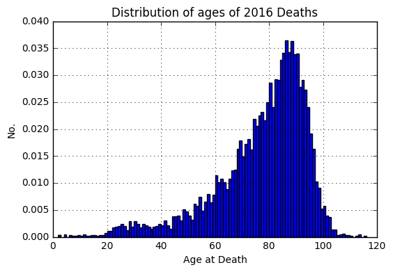
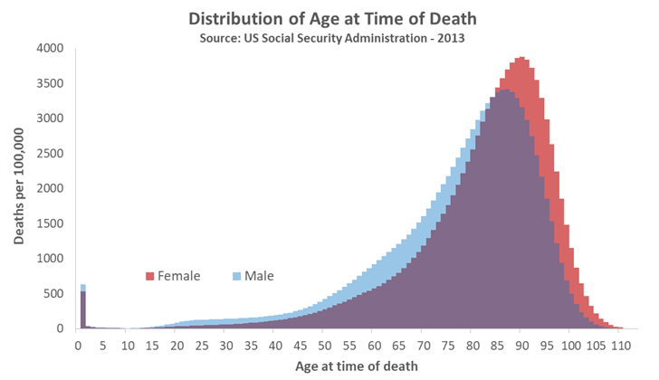
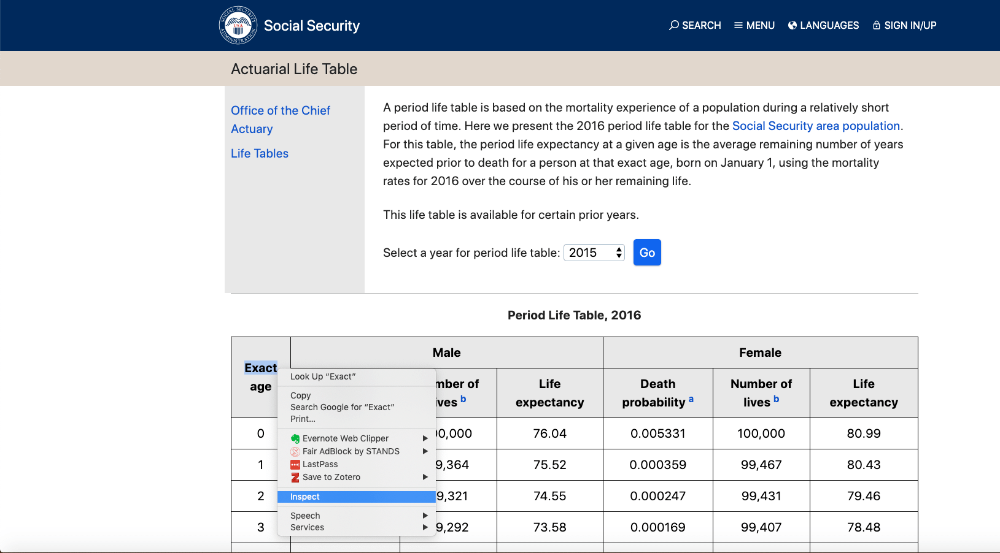
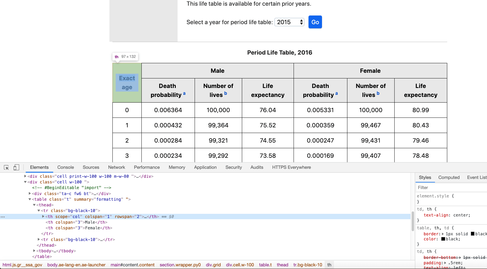
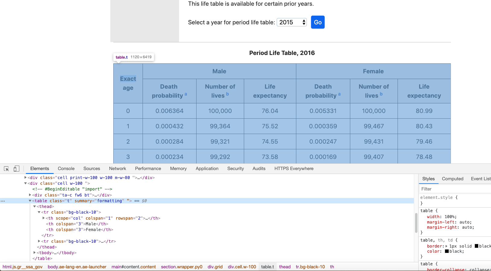
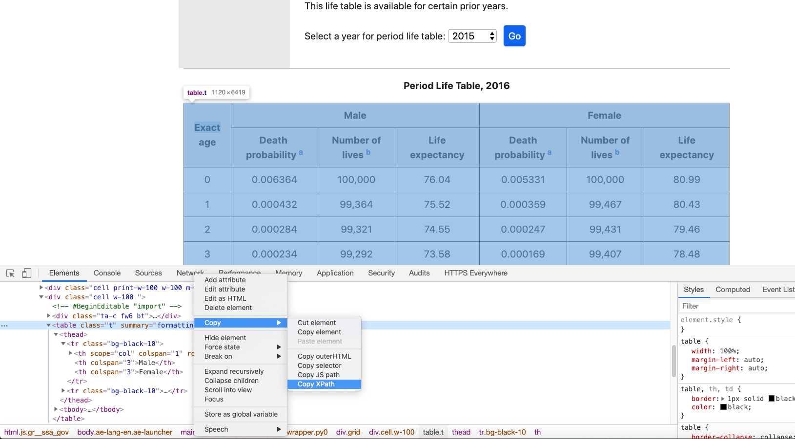

# Still missing
## Loading and tidying data from Excel sheet
## Display distribution (same as from web scraping)
## Including only text passages? If not -> note
## Check needed packages

# Setup
## Global options

```{r label = "global-options", highlight=TRUE}

### setting up working environment
### for details see: https://yihui.name/knitr/options/
knitr::opts_chunk$set(
        echo = T,
        message = T,
        error = T,
        warning = T,
        comment = '##',
        highlight = T,
        prompt = T,
        strip.white = T,
        tidy = T
        )

```

## Installing and loading R packages


```{r installing-and-loading-R-packages}

### accompanying R package: https://github.com/gitrman/itns
if (!require("itns"))
        {remotes::install_github("gitrman/itns", 
                         build = TRUE, build_opts = c("--no-resave-data", "--no-manual"))
        library("itns")}


### https://www.tidyverse.org/
if (!require("tidyverse"))
        {install.packages("tidyverse", repos = 'http://cran.wu.ac.at/')
        library(tidyverse)}

### above command installed and loaded the core tidyverse packages:
# ggplot2: data visualisation
# tibble:  a modern take on data frames
# tidyr:   data tidying
# readr:   data import (csv, tsv, fwf)
# purrr:   functional R programming
# dplyr:   data (frame) manipulation
# stringr: string manipulation
# forcats: working with categorial varialbes


### to calculate mode:
if (!require("modeest"))
        {install.packages("modeest", repos = 'http://cran.wu.ac.at/')
        library(modeest)}

# I am going to use the `janitor` package for calculating table totals
if (!require("janitor"))
        {install.packages("janitor", repos = 'http://cran.wu.ac.at/')
        library(janitor)}

```

## Theme adaption for the graphic display with `ggplot2`

```{r generate-my-own-theme}

my_theme <- theme_light() +
        theme(plot.title = element_text(size = 10, face = "bold", hjust = 0.5))
        theme(plot.background = element_rect(color = NA, fill = NA)) +
        theme(plot.margin = margin(1, 0, 0, 0, unit = 'cm'))
```


# End-of-Chapter Exercises

## Find z scores

> For a standardized exam of statistics skill, scores are normally distributed: μ = 80, σ = 5. Find each student’s _z_ score:

a. Student 1: X = 80
b. Student 2: X = 90
c. Student 3: X = 75
d. Student 4: X = 95


The formula is $z = (X-μ)/σ$.

```{r find-z-score}
(80-80)/5 # a.
(90-80)/5 # b.
(75-80)/5 # c.
(95-80)/5 # d.
```

a. $z = 0$
b. $z = 2$
c. $z = -1$
d. $z = 3$

## Find percentage of better students

> For each student in Exercise 1, use R to find what percent of students did better. (Assume _X_ is a continuous variable.)

I am using the `pnorm` command. You can get an explanation by using the help command `help(pnorm)` or `help(Normal)`:

```{r percentage-better}
help(Normal)
(1 - pnorm(0)) * 100
(1 - pnorm(2)) * 100
(1 - pnorm(-1)) * 100
(1 - pnorm(3)) * 100
```

> Percent better: a. 50%; b. 2.28%; c. 84.1%; d. 0.1%.

## Calculation of SE

> Gabriela and Sylvia are working as a team for their university’s residential life program. They are both tasked with surveying students about their satisfaction with the dormitories. Today, Gabriela has managed to survey 25 students; Sylvia has managed to survey 36 students. The satisfaction scale they are using has a range from 1 to 20 and is known from previous surveys to have _σ_ = 5.

### Estimation 1

> No mathematics, just think: which sample will have the smaller SE: the one collected by
Gabriela or the one collected by Sylvia?

> Sylvia’s sample will have the smaller SE because she has collected a larger sample.

### Estimation 2

> When the two combine their data, will this shrink the SE or grow it?

> Combining the two samples will yield a smaller SE.

### Calculation 

> Now calculate the SE for Gabriela’s sample, for Sylvia’s sample, and for the two samples
combined.

The formula is $SE = σ / \sqrt{N}$.

```{r calculate-SE}
5 / sqrt(25)
5 / sqrt(36)
5 / sqrt(25+36)
```

> For Gabriela, SE = 1; For Sylvia, SE = 0.83; Combined, SE = 0.64.

### Is the sample size sufficient?

> How big a sample size is needed? Based on the combined SE you obtained, does it seem like the residential life program should send Gabriela and Sylvia out to collect more data? Why or why not? This is a judgment call, but you should be able to make relevant comments. Consider not only the SE but the range of the measurement.

> What sample size is sufficient is a judgment call, which we’ll discuss further in Chapter 10. For now we can note that the combined data set provides SE = 0.64, meaning that many repeated samples would give sample mean satisfaction scores that would bounce around (i.e., form a mean heap) with standard deviation of 0.64. Given that satisfaction has a theoretical range from 1 to 20, this suggests that any one sample mean will provide a moderately precise estimate, reasonably close to the population mean. This analysis suggests we have sufficient data, although collecting more would of course most likely give us a better estimate.

## Nursing home and random sampling

> Rebecca works at a nursing home. She’d like to study emotional intelligence amongst the seniors at the facility (her population of interest is all the seniors living at the facility). Which of these would represent random sampling for her study?

> a) Rebecca will wait in the lobby and approach any senior who randomly passes by.
> b) Rebecca will wait in the lobby. As a senior passes by she will flip a coin. If the coin lands heads she will ask the senior to be in the study, otherwise she will not.
> c) Rebecca will obtain a list of all the residents in the nursing home. She will randomly select 10% of the residents on this list; those selected will be asked to be part of the study.
> d) Rebecca will obtain a list of all the residents in the nursing home. She will randomly select 1% of the residents on this list; those selected will be asked to be part of the study.

> c and d represent random sampling because both give each
member of the population an equal chance to be in the study, and members of the sample are selected independently

## Skewed distributions

> Sampling distributions are not always normally distributed, especially when the variable measured is highly skewed. Below are some variables that tend to have strong skew.
> a) In real estate, home prices tend to be skewed. In which direction? Why might this be?
> b) Scores on easy tests tend to be skewed. In which direction? Why might this be?
> c) Age of death tends to be skewed. In which direction? Why might this be?
> d) Number of children in a family tends to be skewed. In which direction? Why might this be?

> ad a) Home prices tend to be positively skewed (longer tail to the right), because there is a lower boundary of zero, but in effect no maximum—typically a few houses have extremely high
prices. These form the long upper tail of the distribution.

> ad b) Scores on an easy test tend to be negatively skewed (longer tail to the left). If the test is very easy, most scores will be piled up near the maximum, but there can still be a tail to the left representing a few students who scored poorly.

> ad c) Age at time of death tends to be negatively skewed (longer tail to the left). Death can strike at any time (☹), leading to a long lower tail; however, many people (in wealthy countries) die at around 70–85 years old, and no one lives forever, so the distribution is truncated at the upper end.

Searching for “distribution of age at death”, or similar, will find you graphs showing this
strong negative skew.

What follows are two examples for this negatively skewed distributions of age at time of death:






> ad d) Number of children in a family tends to be positively skewed (longer tail to the right)
because 0 is a firm minimum, and then scores extend upward from there, with many families
having, say, 1–4 children and a small number of families having many children.

## Warning sign for skewed variables

> Based on the previous exercise, what is a caution or warning sign that a variable will be highly skewed?

> Anything that limits, filters, selects, or caps scores on the high or low end can lead to skew. Selection is not the only thing that can produce skew, but any time your participants have been subjected to some type of selection process you should be alert to the possibility of skew in the variables used to make the selection (and in any related variables). 

>Also, if the mean and median differ by more than a small amount, most likely there is skew, with the mean being “pulled” in the direction of the longer tail.

# Additional exercises

Both graphs above are calculated from data. The first one from [data on wikipedia](https://en.wikipedia.org/wiki/Lists_of_deaths_by_year) using python, the second one used [data from a life table](https://www.ssa.gov/oact/STATS/table4c6_2013.html) of the US social secutiry administration.

This opens up two questions for exercises:

1. How to get data from websites and not especially prepared excel sheets?
2. How to draw these above distributions?

## Getting data from a table on a web page

### Get table data with web scraping

To get data from web pages is called **web scraping**. You will find with a search term line "R web scraping" many articles, tutorial and videos how to do it. Here I am going to use a [blog post by Cory Nissen](http://blog.corynissen.com/2015/01/using-rvest-to-scrape-html-table.html). 

We are going to use the R package `rvest` to write an appropriate script. 

Look at the [US period life table from 2016](https://www.ssa.gov/oact/STATS/table4c6.html): How to get the necessary data for the updates graph of figure 2?


```{r scap-web-table}
# install/load package `rvest`
if (!require("rvest"))
        {install.packages("rvest", repos = 'http://cran.wu.ac.at/')
        library(rvest)}

# store the web url of the page with the table you are interested in
url <- "https://www.ssa.gov/oact/STATS/table4c6.html"
life_table_2016 <- url %>%
  read_html() %>% # from package xml2
  ## 1) go to webpage via google chrome
  ## 2) set cursor on start of the desired table data
  ## 3) right clicked and chose “inspect element”
  ## 4) look for the appropiate line <table …> in the inspector (typically some lines above)
  ## 5) select this <table …> line in the inspector
  ## 6) right click it and select "Copy -> Copy XPath"
  ## 7) include the copied XPath into next line of the R script
  html_nodes(xpath='//*[@id="content"]/section[2]/div/div[3]/table') %>%
  html_table(fill = TRUE)
life_table_2016 <- life_table_2016[[1]]
```

To clarify how to get the correct XPath data compare the following screenshots:



<br /><br />



<br /><br />

<br /><br />


<br /><br />

### Copy table data into a Excel sheet

Another simple way is to 

1. select the table on the web page (without header and footnotes)
2. copy it into the clipboard
3. fire up Excel
4. set the cursor of the first cell of an empty Excel sheet
5. paste the content of the clipboard into the Excel sheet
6. save the data as a .csv file

## Tidy data

### Tidy data frame from web scraping

Looking at the start and tail of the table we see that we need to make the following changes:

1) We only need column 1, 3 and 6 for displaying the age distribution at time of the deaths. 
2) We need to delete the first and last row as it includes textual header information.
3) We need to convert the character columns into columns containing numbers.
3) We need to calculate the number of death from the survival numbers.

```{r tidy-life-table}
# Looking at start and end of table
head(life_table_2016)
tail(life_table_2016)

# We only need column 1, 3 and 6  and have to delete the last (text) line
life_table_2016_v2 <- life_table_2016[c(-1,-nrow(life_table_2016)), c(1,3,6)]

# We need to convert the character columns into columns containing numbers
# In the columns with big number we have additionally to delete all commas from the strings
life_table_2016_v2$`Exact age` <- as.numeric(life_table_2016_v2$`Exact age`)
life_table_2016_v2$Male <- as.numeric(gsub(",","",life_table_2016_v2$Male))
life_table_2016_v2$Female <- as.numeric(gsub(",","",life_table_2016_v2$Female))


# We calculate the difference between rows
life_table_2016_v3 <-
  abs(tail(life_table_2016_v2[, -1], -1) - head(life_table_2016_v2[, -1], -1))
names(life_table_2016_v3)[1] <- "MaleDeath"
names(life_table_2016_v3)[2] <- "FemaleDeath"

# To bind the two data frames we need the same number of rows
firstLine <- data.frame(0,0)
names(firstLine)[1] <- "MaleDeath"
names(firstLine)[2] <- "FemaleDeath"

life_table_2016_v3 <- rbind(firstLine, life_table_2016_v3)
life_table_2016_v4 <- cbind(life_table_2016_v2, life_table_2016_v3)
head(life_table_2016_v4)
tail(life_table_2016_v4)
```


### Tidy data from Excel sheet

## Display distribution for age at time of death

```{r}
df <- reshape2::melt(life_table_2016_v4[,c(1,4,5)] ,  
                     id.vars = 'Exact age', variable.name = 'Gender')
ggplot(df, aes(`Exact age`, value)) + 
  geom_line(aes(colour = Gender)) +
  labs(x = "Age of death in years",
       y = "Death per 100,000") +
  scale_color_discrete(labels=c("Male", "Female")) +
  theme(legend.position = c(.9,.8))

```
